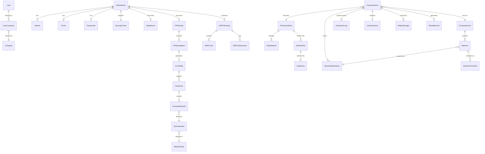

# Data Models & Entity Reference

This document describes the key entities, their relationships, and status flows in the FactoryFlow system.

**Type definitions:** Each module's types live in `src/modules/{name}/types/`. Shared types are in `src/shared/types/common.types.ts`.

---

## Entity Relationship Diagram



---

## Domain Glossary

| Term | Description |
|------|-------------|
| **Gate Entry** | Record of a vehicle/person entering the factory premises. Types: Raw Material, Daily Needs, Maintenance, Construction, Person Gate-In |
| **Security Check** | Guard verification step before a vehicle proceeds inside the factory |
| **Weighment** | Weight recording for raw material vehicles at the factory weighbridge |
| **PO Receipt** | Recording of goods received against a Purchase Order |
| **Arrival Slip** | Document created per PO line item when goods arrive, sent to QC |
| **Inspection** | Quality control check of received materials against defined parameters |
| **Material Type** | Category of raw material (e.g., Sugar, Flavour) with associated QC parameters |
| **QC Parameter** | Measurable quality attribute (e.g., pH, Moisture %) with acceptable ranges |
| **GRPO** | Goods Receipt Purchase Order — posting accepted goods into SAP inventory |
| **Production Plan** | Target production of a finished good with BOM, timeline, and weekly breakdown |
| **BOM** | Bill of Materials — components required to produce one unit of a finished good |
| **Production Run** | Single execution session on a production line for a specific product |
| **Line Clearance** | Pre-production checklist ensuring the line is clean and ready |
| **Machine Checklist** | Per-machine operational readiness check before a run |
| **Yield Report** | Material usage tracking: opening stock, issued, closing, wastage |
| **Waste Management** | Waste recording with multi-level approval (Engineer → AM → Store → HOD) |

---

## Core Entities

### User & Authentication

```
User
├── id: number
├── email: string
├── full_name: string
├── employee_code: string
├── is_active: boolean
├── is_staff: boolean
├── date_joined: string (ISO)
├── permissions: string[]          # Django format: "app_label.codename"
└── companies: UserCompany[]
    ├── company_id: number
    ├── company_name: string
    ├── company_code: string       # Used in Company-Code header
    ├── role: string
    ├── is_default: boolean
    └── is_active: boolean
```

**File:** `src/core/auth/types/auth.types.ts`

### Shared Types

```
BaseEntity { id: string, createdAt: string, updatedAt: string }
SelectOption<T> { label: string, value: T, disabled?: boolean }
PaginationState { page, pageSize, total, totalPages: number }
SortState { sortBy: string, sortOrder: 'asc' | 'desc' }
TableState extends PaginationState & SortState { search?: string }
AsyncStatus = 'idle' | 'loading' | 'success' | 'error'
AsyncState<T> { data: T | null, status: AsyncStatus, error: string | null }
```

**File:** `src/shared/types/common.types.ts`

---

## Status State Machines

### Vehicle Entry Status

```
DRAFT ──→ IN_PROGRESS ──→ QC_COMPLETED ──→ COMPLETED
  │            │
  ↓            ↓
CANCELLED   REJECTED
```

### QC Inspection Workflow

```
                    ┌─── REJECTED (at any approval stage)
                    │
NOT_STARTED ──→ DRAFT ──→ SUBMITTED ──→ QA_CHEMIST_APPROVED ──→ QAM_APPROVED
                                │                                      │
                                └──── (send back to gate) ────────────┘

Final Status: PENDING → ACCEPTED | REJECTED | HOLD
```

### Arrival Slip Status

```
DRAFT ──→ SUBMITTED
  ↑            │
  └── REJECTED ┘  (sent back from QC)
```

### GRPO Posting Status

```
PENDING ──→ POSTED
  │
  ↓
FAILED
  │
  ↓
PARTIALLY_POSTED
```

### Production Plan Status

```
DRAFT ──→ OPEN ──→ IN_PROGRESS ──→ COMPLETED ──→ CLOSED
  │                                                  ↑
  ↓                                                  │
CANCELLED ←──────────────────────────────────────────┘

SAP Posting: NOT_POSTED → POSTED | FAILED
```

### Production Run Status

```
DRAFT ──→ IN_PROGRESS ──→ COMPLETED
```

### Line Clearance Status

```
DRAFT ──→ SUBMITTED ──→ CLEARED
                   └──→ NOT_CLEARED
```

### Waste Approval Status

```
PENDING ──→ PARTIALLY_APPROVED ──→ FULLY_APPROVED

Approval chain: Engineer → Area Manager → Store → HOD
```

---

## Cross-Module Data Flow

The factory process follows this sequence, with each step producing data consumed by the next:

```
1. Gate Entry          VehicleEntry created (vehicle, driver, transporter)
       ↓
2. Security Check      SecurityCheck approved → entry proceeds
       ↓
3. PO Receipt          POReceipt + POReceiptItems linked to entry
       ↓
4. Arrival Slip        ArrivalSlip created per PO line item
       ↓
5. Weighment           Weighment recorded for raw material entries
       ↓
6. QC Inspection       Inspection with ParameterResults per ArrivalSlip
       ↓
7. GRPO Posting        Accepted items posted to SAP inventory
       ↓
8. Production Plan     Plan created referencing SAP items (BOM)
       ↓
9. Production Run      Run executes plan on a line with logs, breakdowns, materials
       ↓
10. Reports            Yield, daily production, analytics
```

---

## Module Type File Reference

| Module | Type File | Key Types |
|--------|-----------|-----------|
| Auth | `src/core/auth/types/auth.types.ts` | `User`, `UserCompany`, `LoginResponse`, `AuthState` |
| Gate | `src/modules/gate/types/` (distributed across API files) | `VehicleEntry`, `Vehicle`, `Driver`, `Transporter`, `SecurityCheck`, `Weighment`, `POReceipt` |
| QC | `src/modules/qc/types/qc.types.ts` | `ArrivalSlip`, `Inspection`, `MaterialType`, `QCParameter`, `ParameterResult` |
| GRPO | `src/modules/grpo/types/grpo.types.ts` | `GRPOHistoryEntry`, `PreviewPOReceipt`, `GRPOAttachment` |
| Planning | `src/modules/production/planning/types/planning.types.ts` | `ProductionPlan`, `PlanMaterial`, `WeeklyPlan`, `DailyProductionEntry`, `BOMComponent` |
| Execution | `src/modules/production/execution/types/execution.types.ts` | `ProductionRun`, `ProductionLine`, `Machine`, `ProductionLog`, `MachineBreakdown`, `LineClearance`, `WasteManagement` |
| SAP Dashboard | `src/modules/dashboards/sap-plan/types/sap-plan.types.ts` | `SummaryOrder`, `DetailOrder`, `ProcurementItem` |
| Notifications | `src/modules/notifications/types/sendNotification.types.ts` | `SendNotificationRequest`, `CompanyUser` |
| Shared | `src/shared/types/common.types.ts` | `BaseEntity`, `SelectOption`, `PaginationState`, `AsyncState` |
